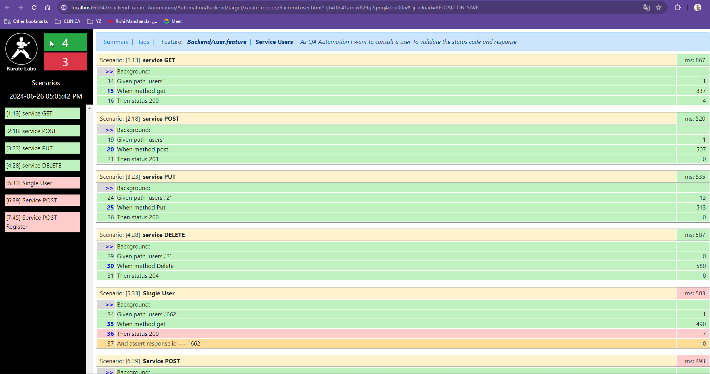

# backend_karate
Automation neoris Automation Workshop

Automation will be performed for the service https://reqres.in for HTTP methods: GET, POST, PUT and DELETE. The implementation of this test will be done through the Karate framework that allows us to automate Apis to identify possible test cases to find possible failures, allowing a better optimization of manual testing, what is sought is to improve the quality of the product, saving time and cost.

For the report visualization we work with cucumber
We use Gherkin and cucumber tools for our automation

